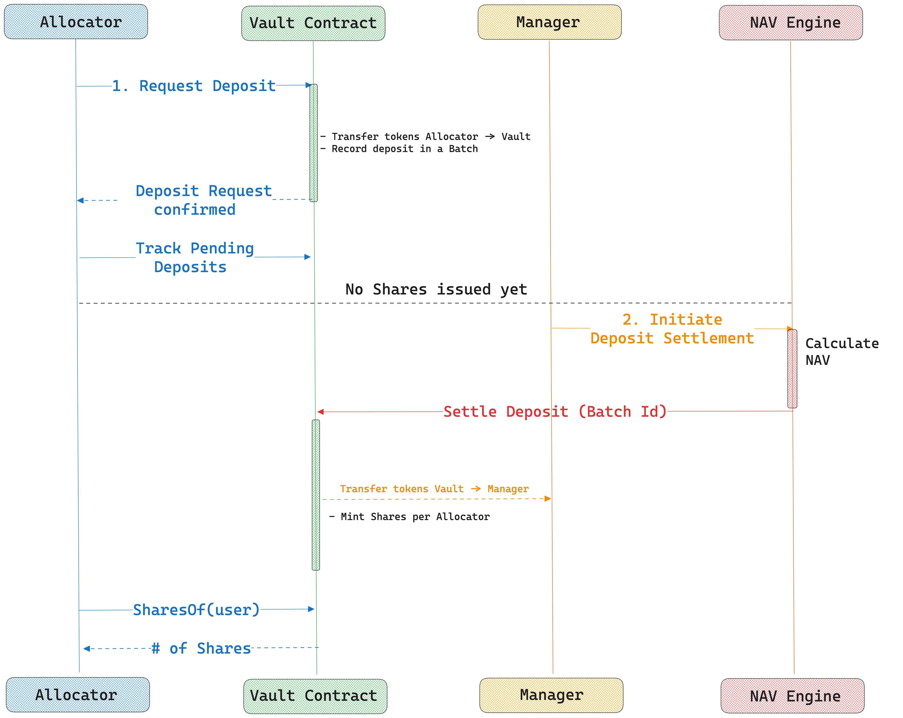
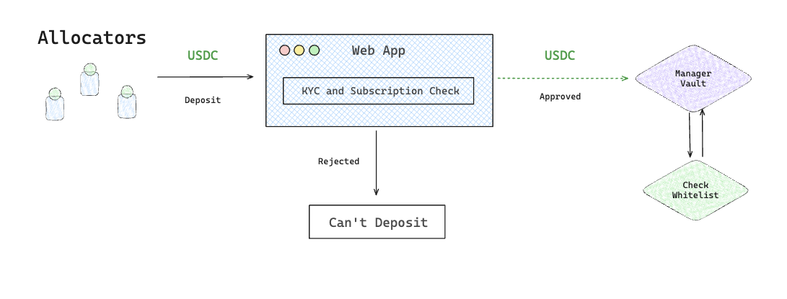
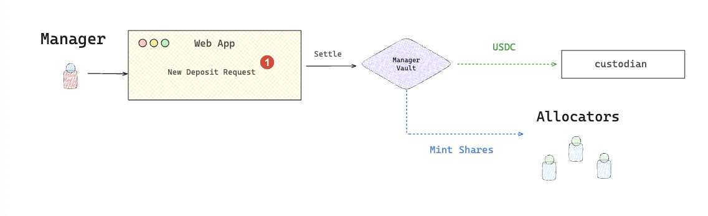

# Deposit


When allocators deposit their tokens into the vault, they receive **shares** in return. These shares represent the user’s **proportional claim of the pooled assets**, including any yield or interest earned over time.


### Asynchronous Deposit Process

The deposit flow is asynchronous, meaning tokens are accepted immediately, but shares are only issued (minted) after NAV settlement.&#x20;

<figure><figcaption></figcaption></figure>

The process consists of two phases:

**Important Notes:**
- Only one deposit request per user per batch is allowed
- Minimum deposit amounts are enforced per share class
- Maximum deposit caps can be set per share class
- Deposits in the current batch are not settled in that cycle (roll to next batch)
- KYC/authentication may be required based on vault configuration

### Request Deposit

Deposits are asynchronous: the deposit action is instant, but shares are minted upon NAV settlement.

<figure><figcaption></figcaption></figure>

1. Users initiate deposits by calling `requestDeposit` function with:
   - `classId`: The share class to deposit into
   - `amount`: The amount of underlying tokens to deposit
   - `authSignature`: AuthSignature structure containing signature bytes and expiry block (if KYC/auth is enabled)
2. The deposit amount is transferred to the vault and requests are recorded against the current batch
3. Users can track their pending deposit requests using:
   - `depositRequestOf(classId, user)`: Total pending deposits across all batches
   - `depositRequestOfAt(classId, user, batchId)`: Deposits for a specific batch

### Settle Deposit

Upon settlement, the Oracle calls `settleDeposit` to finalize all queued deposits for a specific class. The number of shares issued is calculated based on the current Net Asset Value (NAV) and total share supply.

<figure><figcaption></figcaption></figure>

1. Oracle initiates settlement by calling `settleDeposit` with:
   - `classId`: The share class to settle
   - `toBatchId`: The batch to settle up to (excluding current batch)
   - `newTotalAssets`: Array of updated NAV values for each series from off-chain calculations
   - `authSignature`: Authentication signature (if settlement auth is enabled)
2. The vault calculates shares to mint based on:
   - Current price per share (NAV / total shares)
   - Deposited amounts for each user
3. New shares are minted and allocated to depositors in the appropriate series:
   - Lead series (Series 1) for initial deposits
   - New series created if performance fees apply
4. Deposited tokens are transferred to the Custodian address
5. Management and performance fees are calculated and accrued
6. Series may be consolidated if conditions are met

