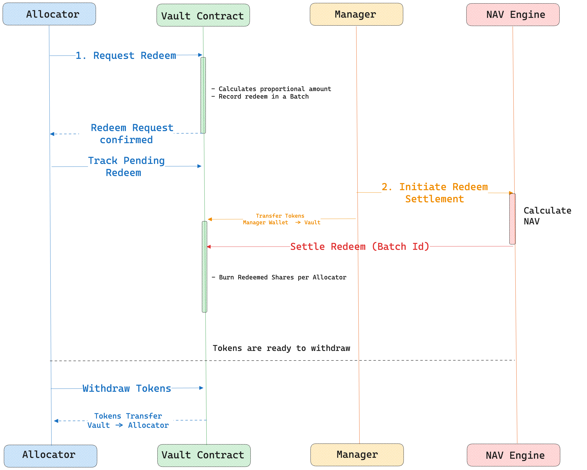
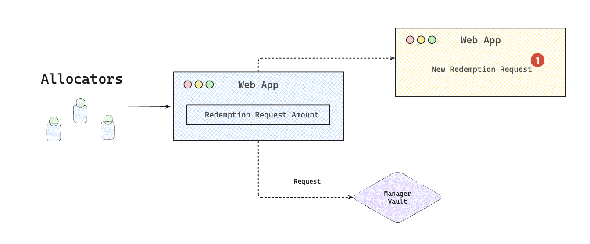
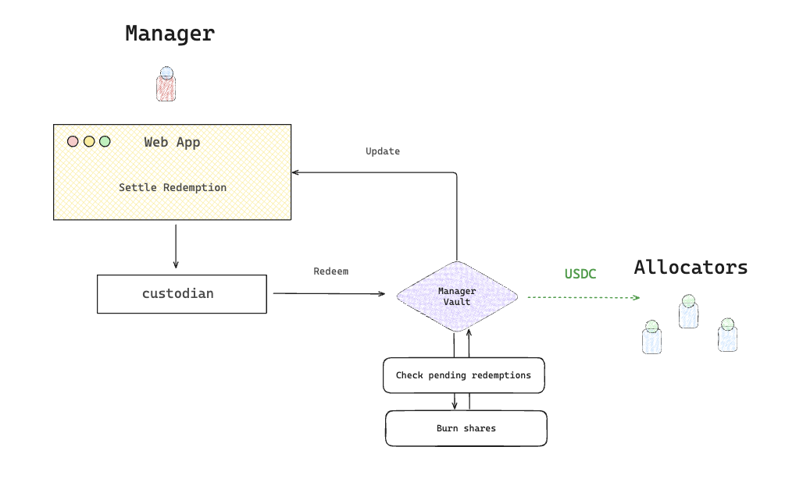

# Redemption


When allocators request a withdrawal by redeeming their shares, they receive a proportional amount of the underlying assets from the vault, reflecting their claim on the pooled funds and accumulated yield.


### Asynchronous Redeem Lifecycle

Redemptions are asynchronous, meaning tokens are transferred after NAV settlement, ensuring fair asset distribution.&#x20;

<figure><figcaption></figcaption></figure>

The process consists of multiple phases:

**Important Notes:**
- Redemptions are processed as a percentage of total user holdings in a class
- Notice periods may delay when redemptions can be processed
- Lock-in periods prevent new investors from immediate redemptions
- Minimum redemption amounts are enforced per share class
- Redemptions in the current batch are not settled in that cycle (roll to next batch)
- Settled redemptions must be explicitly withdrawn by users

### Request Redeem

Allocators initiate a redemption by specifying the portion of their holdings to redeem.

<figure><figcaption></figcaption></figure>

1. Users call `requestRedeem` with:
   - `classId`: The share class to redeem from
   - `estAmountToRedeem`: The estimated amount of underlying tokens to redeem
2. The system calculates share units based on the current price-per-share (PPS) at the time of request
3. The redemption request is recorded against the current batch as share units
4. **Important**: The actual amount received after settlement may differ from the requested amount due to NAV changes and fees
5. Important constraints:
   - Notice period: Users may need to wait a certain number of batches before redemption
   - Lock-in period: New investors may be locked for a specified number of batches
   - Minimum redemption amounts apply per class
6. Users can track their pending redemption requests using:
   - `redeemRequestOf(classId, user)`: Total pending redemptions across all batches
   - `redeemRequestOfAt(classId, user, batchId)`: Redemptions for a specific batch

### Settle Redeem

Upon NAV settlement, the Oracle calls `settleRedeem` to finalize all pending redemptions for a specific class.

<figure><figcaption></figcaption></figure>

1. Oracle calls `settleRedeem` with:
   - `classId`: The share class to settle
   - `batchId`: The batch to settle up to (excluding current batch)
   - `newTotalAssets`: Updated NAV from off-chain calculations
   - Auth signature (if settlement auth is enabled)
2. For each redeemer:
   - Shares are proportionally deducted from all series they hold
   - The exact amount of underlying tokens is calculated based on current NAV
   - Shares are burned from the appropriate series
3. Redeemed assets are added to the user's `redeemableAmount` balance
4. Management and performance fees are calculated and accrued

### Withdraw Redeemable Amount

After settlement, users can withdraw their redeemable assets:

1. Users call `withdrawRedeemableAmount()` to claim all settled redemptions
2. The vault transfers the underlying tokens from vault to the user
3. The user's `redeemableAmount` balance is reset to zero

**Force Redemption:**
Managers can force redemptions for specific users using `forceRedeem(user)` for regulatory compliance or risk management purposes.
