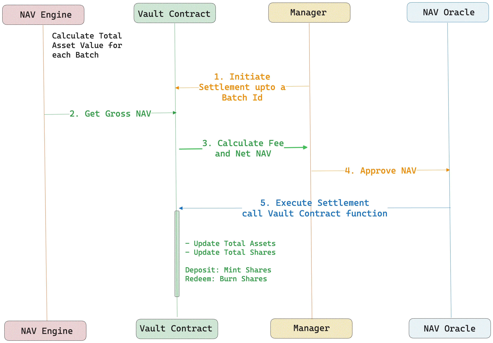

---
layout:
  width: default
  title:
    visible: true
  description:
    visible: true
  tableOfContents:
    visible: true
  outline:
    visible: true
  pagination:
    visible: true
  metadata:
    visible: true
---

# Settlement

**Settlement** is how the Vault finalizes pending **deposits** and **redemptions** requests. Its purpose is to ensure that everyone in the same settlement cycle gets a fair and consistent price, based on the **Net Asset Value (NAV)** provided by the NAV Engine.

#### Types of Settlement

* **Deposit Settlement**: Finalizes pending deposit requests.
* **Redemption Settlement**: Finalizes pending redemption requests.

#### Settlement Execution

Each vault tracks settlement progress using below identifiers:

* **Deposit Settle Id** - The batch identifier up to which all deposit requests have been settled.\
  &#xNAN;_&#x45;xample_: If `depositSettleId = 5`, then deposits up to batch 5 are complete; deposits in batch 5 or higher remain pending.
* **Redeem Settle Id -** The batch identifier up to which all redemption requests have been settled.

When triggered, the settlement process finalizes all pending batches sequentially, starting from the last settled batch ID up to the current batch ID, within a single cycle.

The settlement steps occur in the following order:

1. Process all pending redemption requests with updated NAV.
2. Process all pending deposit requests with existing NAV.

#### Share price dynamics:

* The **price per share** increases as the vault’s NAV grows.
* New deposits receive proportionally fewer shares when the NAV is higher.
  * **Example:** An initial deposit of $1 = 1 share. A later deposit of $1 may only mint 0.9 shares if the NAV has increased.

***

### Settlement Process Flow

<figure><picture><source srcset="../../.gitbook/assets/Aleph-settle-sequence.png" media="(prefers-color-scheme: dark)"></picture><figcaption></figcaption></figure>

1. **NAV Calculation**\
   The NAV engine calculates the total asset value of the vault for a given batch ID across all allocator series.
2. **Fee Calculation:**\
   The NAV engine provides the gross NAV for a specific batch ID to the vault smart contract. The Vault contract then computes all applicable fees for the settlement window. These fees are deducted from the gross NAV, resulting in the net NAV used for settlement.
3. **Manager Review**\
   The Manager reviews the net NAV to ensure accuracy and consistency before proceeding.
4. **Settlement Trigger**\
   Once approved, the Manager initiates settlement through the NAV Oracle, which internally executes the settlement functions on the vault smart contracts.
5.  **Share Adjustments**

    Investor balances are updated:

    * New shares are **minted** to fulfill deposit requests.
    * Shares are **burnt** to fulfill redemption requests.

***

### Deposit Settlement

The process finalizes pending deposit requests over one or more batches, updates the class/series accounting (assets & shares), and transfers the corresponding underlying tokens to the manager wallet.

#### Key Characteristics

* **Batch Window Validity**\
  Settles deposits for a specific vault's last `depositSettleId` up to (but not including) `toBatchId`. After settlement, the vault `depositSettleId` is advanced to `toBatchId`.
* **Shares Series Specific Accounting**\
  During settlement, if the Lead Series reaches a new high-water mark and other active series exist, all outstanding series are consolidated into the Lead Series and pending deposits are also settled directly into the Lead Series. If no new high-water mark is set, a separate series is created to settle the pending deposits. For the settled series
  * `totalAssets` increases by the sum of settled deposit amounts.
  * `totalShares` increases by the shares minted for depositors at the momentary PPS.
* **Funds Movement to Manager Wallet**\
  The aggregate underlying received from settled deposits is transferred to the manager wallet in a single transfer per settlement call.

***

### Redeem Settlement

The process finalizes pending redemption requests over one or more batches, applies fee logic, updates class/series accounting, and pays out the underlying tokens to redeeming allocators.

#### Key Characteristics

* **Notice Period Enforcement**\
  Redemptions can only be settled after the required **notice period** has passed, ensuring enough time for liquidity and compliance checks.
*   **Shares Series Specific Accounting**

    Settlements are handled per series for accurate fee calculations.\
    Per-Series Totals

    * `totalShares` **decreases** by the amount of shares burnt for redemptions.
    * `totalAssets` **decreases** by the underlying paid out to redeemers (post-fee accrual).
*   **Funds Movement to Allocators**

    Once the redemption settlement is completed, the allocators can withdraw the underlying tokens from the Vault.

***

### Fee Accrual

During deposit or redeem settlement, the Performance and Management fees are accumulated. These fees are represented as **additional fee shares** (dilution) rather than directly debiting assets, and are minted to the corresponding fee recipients.

#### Series Management (Performance Fee Classes)

For share classes that include performance fees, settlement involves additional series management logic:

* **New Series Creation:** A new series is created when deposits are made and the vault has not yet reached a new high-water mark.
* **Series Consolidation:** Once the vault reaches a new high-water mark, outstanding series are consolidated into the lead series. User shares are proportionally transferred to this lead series.

#### **High watermark**

Performance fees apply **only** on gains above the current HWM, and the HWM is updated only when a performance fee is actually taken.
