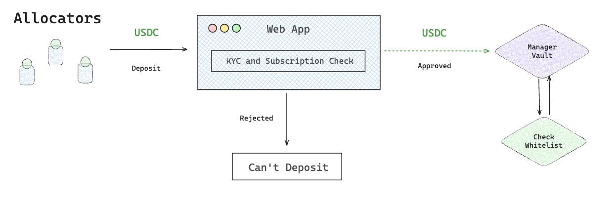

# Deposit

This flow allows you to deposit ERC-20 tokens into a Vault and receive Vault Shares.

Vault Shares are not issued immediately, they are minted after the batch is settled, typically on a monthly schedule, depending on the Vault’s configuration.

<figure><picture><source srcset="../../../.gitbook/assets/Aleph-deposit-request (1).png" media="(prefers-color-scheme: dark)"></picture><figcaption></figcaption></figure>

### Prerequisite

* [Onboarding](onboarding.md)



#### Go to the Vault Page

* Navigate to the Vault you want to invest in
* Click **“Deposit”**

> The **Deposit button is only active once per batch period** (e.g., daily). If it's disabled, check back later or view your existing deposits.



#### **Enter Deposit Amount**

Input the amount of the accepted ERC-20 token you want to deposit (e.g., USDT, USDC)



#### Confirm & Submit Transaction

Your wallet will request a signature to approve and send the deposit.

Behind the scenes:

* The frontend sends a `requestDeposit(amount)` transaction to the Vault smart contract
* Your ERC-20 tokens are transferred to the Vault



#### Track Deposit Status

After the transaction succeeds, your deposit is now marked as **“Pending Settlement”.**

Once settlement is complete, corresponding Vault Shares will be minted.


