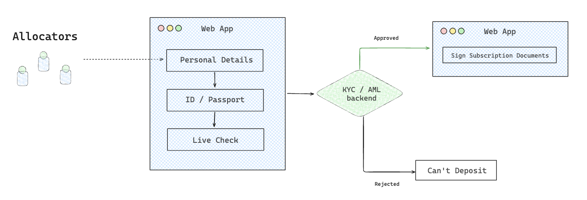

# Onboarding

Before you can invest in a Vault, you must complete a one-time onboarding process including submitting your KYC, reviewing and signing legal agreements to gain deposit access to a specific Vault.

> Onboarding is **Vault-specific**. Each Vault may have different KYC and legal requirements based on its fund structure and jurisdiction.

<figure><figcaption></figcaption></figure>



#### Visit the Vault Page

Go to the Vault you wish to invest in and Click **“Start Onboarding”**



#### Complete KYC (Identity Verification)

* A KYC form will open directly inside the page
* Submit your:
  * Government-issued ID
  * Proof of residence or business details
* Verification typically takes a few minutes to 24 hours



#### Wait for KYC Approval

* You will automatically receive an update once your KYC is approved
* If approved, you’ll proceed to the next step
* If rejected, the process will stop, and you’ll be notified



#### Review & Sign Legal Documents

Once KYC is approved:

* You’ll see the legal agreements for the Vault:
  * Limited Partnership Agreement (LPA)
  * Subscription Agreement
* Review the documents carefully
* Use the built-in signing tool (e.g., Dropbox Sign) to digitally sign them



#### **Await Manager Approval**

* After signing, your onboarding profile is sent to the Vault Manager for final review
* The Manager may:
  * Approve your profile → You’re onboarded
  * Reject it → You’ll be notified via email

> You’ll receive a confirmation email once approved.



#### Onboarding Complete

Once approved:

* Your wallet is **whitelisted** to deposit into the Vault
* You’ll see a **“Deposit Now”** button on the Vault page


