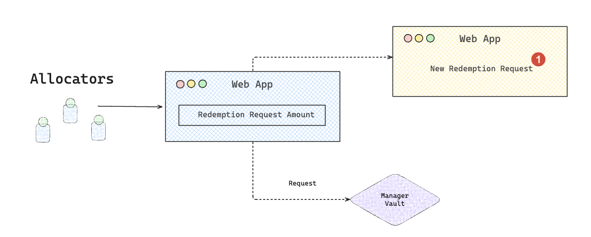

# Redemption

The **Redeem** flow allows you to withdraw from the Vault by redeeming your Vault Shares in exchange for the underlying ERC-20 tokens.

Tokens are not transferred immediately. Payouts occur only after the batch settlement, based on the fund’s current NAV.

<figure><picture><source srcset="../../../.gitbook/assets/Aleph-redeem-request (1).png" media="(prefers-color-scheme: dark)"></picture><figcaption></figcaption></figure>



#### Open the Vault Dashboard

Go to the Vault you want to withdraw from and Click **“Redeem"**



#### Enter Redemption Amount

Input the amount of underlying ERC-20 tokens you want to redeem.



#### Submit Transaction

Click "**Confirm"** and your wallet will prompt you to sign the transaction.

Once signed, an equivalent percentage of Shares is automatically calculated based on the last settled NAV and recorded in the current redemption batch.



#### Track the withdrawal

Once your transaction is confirmed, Redemption request status is marked as "Pending Settlement".

Once settlement is complete, corresponding ERC-20 tokens will be ready to claim by Allocator.



#### Withdraw tokens

Once the redeem requests have been settled by the manager, the **“Withdraw Tokens”** option will be enabled in the Allocator App.

At that point, Click "**Withdraw Tokens"** and your wallet will prompt you to sign the transaction. Your specified underlying ERC-20 tokens will be immediately transferred to your account.


