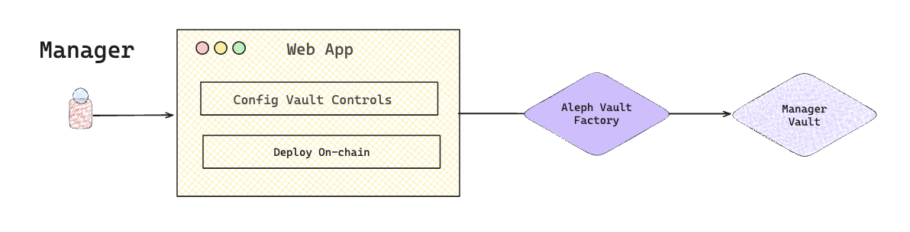

# Create Vault

Vaults in Aleph are deployed on-chain via the **Aleph Vault Factory** using custom configurations by the Manager. This guide walks through the full deployment process initiated from the **Manager App UI**, including wallet connection, configuration validation, on-chain deployment.

<figure><picture><source srcset="../../../.gitbook/assets/Aleph-create-vault.png" media="(prefers-color-scheme: dark)"></picture><figcaption></figcaption></figure>

### Vault Deployment Flow



#### Connect Your Wallet

* Go to the Aleph Manager App.
* Click **“Connect Wallet”**.
  * You can log in with **email** or connect a wallet directly (MetaMask, WalletConnect, etc.).

> Aleph uses **Privy** to handle secure authentication and wallet access.



#### Existing Vault Check

Once your wallet is connected:

* If **your Vault is already deployed**, you'll be taken to your **Vault Dashboard**.
* If **no Vault configuration is found**, you’ll be asked to fill out a quick form to start the onboarding process.
  * The Aleph team will work with you offline to finalize your Vault configuration.
* If a new **Vault configuration is available** for your wallet, the app will show a summary view of your Vault setup.



#### Review Your Vault Configuration

The deployment screen will display key details about your Vault:

| Parameter                | Description                                 |
| ------------------------ | ------------------------------------------- |
| **Vault Name**           | Your fund’s name                            |
| **Strategy Description** | Overview of your investment approach        |
| **Underlying Asset**     | Token the vault accepts (e.g. USDT)         |
| **Custodian Address**    | The off-chain wallet where funds are held   |
| **Fees**                 | Management & Performance fee percentages    |
| **Capacity Limits**      | Min/Max deposits, Total Vault size          |
| **KYC Flow ID**          | Attached compliance workflow                |
| **Signed Doc ID**        | Legal document reference for investor T\&Cs |



#### Sign the Deployment Transaction

Once you’ve reviewed your Vault config:

1. Click **“Deploy Vault”**.
2. Privy will present the deployment transaction for you to sign with your wallet.
3. After signing, the transaction will be broadcasted to the blockchain.
4. Once confirmed, your Vault is officially live for Allocators to deposit funds.

> Your Vault is now being deployed via the **Aleph Vault Factory** smart contract.



#### Access Your Vault Dashboard

After successful deployment, you’ll be automatically redirected to your **Vault Dashboard**, where you can:

* Track NAV
* View Pending deposits or redeem requests.
* Settle Deposit or Redeems


