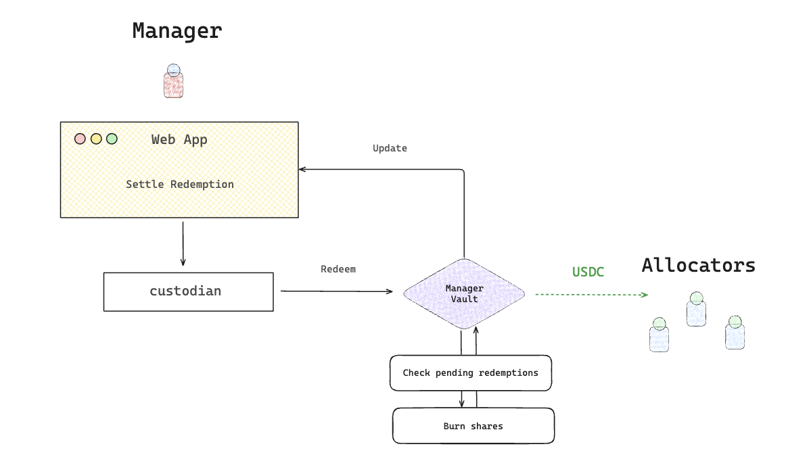

# Settle Redeem

The Settle Withdraw flow is responsible for fulfilling user redemption requests by returning ERC-20 tokens and burning their Vault Shares.

**When:** Monthly (or as scheduled by your fund)

<figure><picture><source srcset="../../../.gitbook/assets/Aleph-settle-redeem (1).png" media="(prefers-color-scheme: dark)"></picture><figcaption></figcaption></figure>



#### Open Manager App

* Navigate to your **Vault Dashboard**
* Click the **“Settle Redeem”** button\
  (_Only Enabled if pending redemptions exist_)



#### Review Settlement NAV

* Review the proposed settlement NAV
* Approve it to proceed with redemption settlement.



#### Ensure Token Availability

To ensure the Vault has enough ERC-20 tokens, transfer the required ERC-20 tokens from the Manager wallet back into the Vault.


If the Vault does not have enough tokens, the `settleRedeem()` transaction will revert.




#### Settlement Process

When settlement is executed:

* The corresponding Vault Shares are burned.
* Fee Shares are minted to the Fee Recipients.
* Redeemers’ ERC-20 tokens become available for withdrawal.



In the end The **Manager App** reflects:

* Reduced Vault share supply
* Updated asset balances
* Redemption batch records
