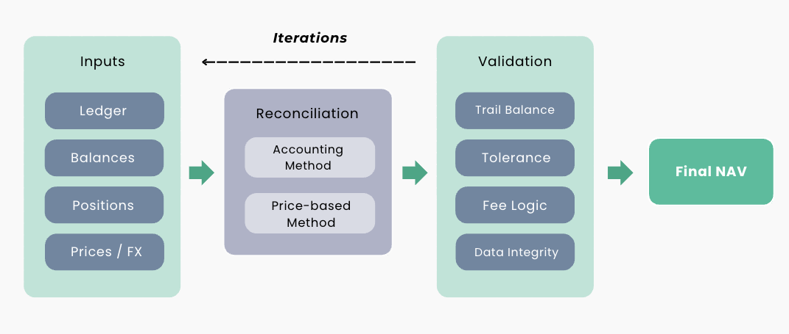

# NAV Calculation

### Overview

NAV Calculation is the process that underpins the [NAV Engine](../../product/aleph-vehicle/nav-engine.md). It converts raw data from trading venues into a verified, per-share valuation of the vault. The process is designed to produce a NAV that is transparent, justifiable, and compliant with the expectations of investors and regulators.

<figure><figcaption></figcaption></figure>

### Dual-Method&#x20;

The NAV Engine uses two independent methods to calculate NAV. Both must align within predefined tolerances before NAV can be published:

* **Accounting Method**: Applies double-entry bookkeeping principles to track all transactions and positions over time.
* **Price-Based Method**: Uses real-time market prices to value current balances and positions.

Reconciling these methods ensures NAV integrity and reduces the risk of errors.

## NAV Validation&#x20;

The NAV can be **published** as the official figure only after passing both stages:

### 1. Rule-based Service

Before publication, calculated NAV passes through a series of automated checks:

* **Trial Balance:** Total debits must equal total credits.
* **Method Reconciliation:** Price-based and Ledger-based NAV method outputs must match within tolerance thresholds.
* **Data integrity:** Balances, prices and currency exchange rates must not be stale or missing.
* **Tolerance Checks:** Large deviations or unusual profit/loss movements are flagged.
* **Fee Logic:** Current fees are compared against historical averages.
* **Consistency:** Flags for negative values, NAV per unit ≤ 0, or mismatched share counts.
* **Class Reconciliation:** Sum of all classes and series must equal the total vault NAV.

### 2. Manual Review & Sign-off

A review workflow allows the fund administrator to:

* Inspect the complete NAV breakdown (CEX balances, assets, liabilities, FX, fees).
* Investigate any exceptions flagged by automated checks.
* Compare the current NAV breakdown to the prior NAV settlement.
* Digitally sign off to approve and finalize the NAV.

### Business Logic for Settlement

Once NAV is validated:

1. It becomes the **Final Settlement NAV** for that batch.
2. Redemptions are processed consistently at the same NAV.
3. Deposits are converted into shares at the published price.
4. Fees are accrued and applied based on batch results, using pro-rata and high-water mark logic.

