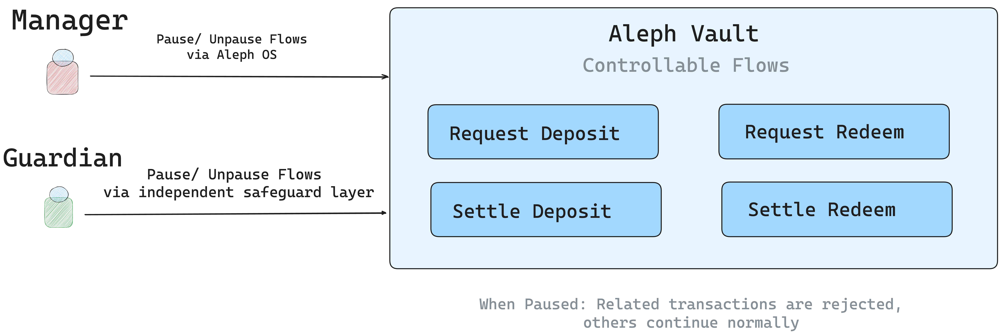

# Safeguards

### Pausing and Unpausing Flows

Aleph Vaults are designed with built-in safety mechanisms that allow managers and guardians to pause (disable) or unpause (enable) specific functions. This provides fine-grained control over vault activity and effective resolution of unexpected issues

<figure><picture><source srcset="../../.gitbook/assets/Aleph-pausable.png" media="(prefers-color-scheme: dark)"></picture><figcaption></figcaption></figure>

#### Purpose and Roles

When a flow is paused, the vault automatically **rejects any transactions** linked to that flow. For example, if the **Request Deposit** flow is paused, investor deposits will not be accepted until the flow is re-enabled. A flow can be paused to isolate issues without halting the entire vault.

* **Managers** can pause and unpause flows directly through AlephOS.
* **Guardians** have the authority to pause flows as an additional safeguard, ensuring there is always an independent layer of protection.

#### List of Flows

The following flows can be paused or unpaused independently:

* **Request Deposit** – Submitting new deposit requests.
* **Request Redeem** – Submitting new redemption requests.
* **Settle Deposit** – Finalizing pending deposits during settlement.
* **Settle Redeem** – Finalizing pending redemptions during settlement.

***

### Guardian

Aleph Vaults feature a dedicated guardian role, providing an independent layer of cybersecurity. The guardian is an external account assigned to protect the vault in unusual scenarios.

By design, the guardian can intervene to reduce risk or stop suspicious activity by actively monitoring and preventing exploits.

This system allows for integration with on chain monitoring and exploit prevention services.

#### Responsibilities and Controls

* The guardian has the ability to [**pause** or **unpause** flows](safeguards.md#pausing-and-unpausing-vault-flows) for security purposes.
* Acts as an independent authority to isolate risks and safeguard investor assets.

***

### Force Redemption

Aleph Vaults allows the **Manager** to forcibly redeem all of an allocator’s shares across all share classes and series. This action fully settles the Allocator’s position based on the last settled NAV, and the corresponding value becomes redeemable by the Allocator through the Allocator app.


Force Redemption exists only for cases where an Allocator must be compelled out of the fund **effective immediately**, and it should be exercised with extreme caution.


* **Compliance Enforcement:** If an allocator fails ongoing KYC/AML checks or becomes legally barred due to regulatory restrictions, the Manager can forcibly remove them while ensuring they receive their entitled funds.
* **Allocator Exit:** If an allocator must be exited from a fund, force redemption provides a one-click way for Manager to settle and pay them out without impacting others.


To complete the off boarding, the Manager must also **blacklist** the allocator from depositing in the future, which can be done explicitly through the **Manager App**.


#### Key Characteristics

* **Manager Discretion:**\
  Only the Manager can trigger a force redemption for an allocator at any time. This function is intended for exceptional circumstances (e.g., compliance, risk, or operational issues).
* **Full Position Settlement:**\
  All of the allocator’s outstanding shares are burnt, and the allocator receives the equivalent amount in underlying tokens, representing the total value of their holdings.\
  Any **pending deposit** or **redeem requests** submitted by that allocator are automatically canceled as part of the process.
* **No Impact on Other Allocators:**\
  Force redemption applies only to the specified allocator. Pending requests and share balances of other allocators remain unaffected. Additionally, this action does not alter the vault price per share (PPS).
