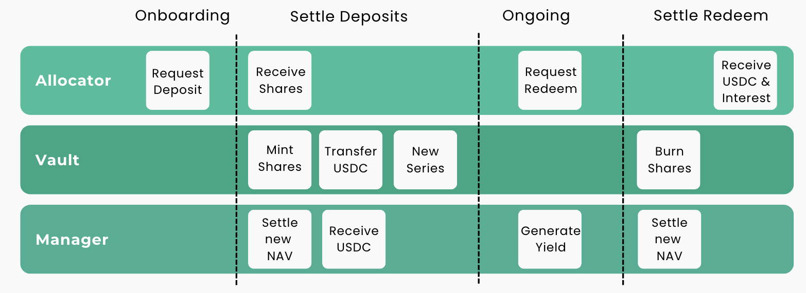

# Aleph Vault

### Overview

Aleph Vaults tokenize yield strategies into non-transferable fund shares, deriving their value from the underlying NAV. The system simplifies complex operations for managers and allocators, handles whitelisting, subscriptions, Classes and Series, HWM, fee accrual, and capital distribution.

### Features

* **Customization:** Apply custom parameters for subscription, fee logic, and other key controls.
* **Fee management:** calculated per class/series and enforced by contracts.
* **Built-in compliance:** whitelisted access through a customized onboarding process with KYC/AML verification, ensuring compliance with diverse regulatory requirements.
* **Canonical states:** deposits/redemptions settle in batches at the same per-share price.

### Onboarding

Allocators apply to access through a digital storefront that simplifies the onboarding process, from KYC to deposit request:

1. **Initiate:** Digital KYC/AML process embedded in-app.
2. **Submit:** Allocators submit the required documents for manager approval.
3. **Confirmation:** Manager approves or rejects the allocator request via AlephOS.
4. **Sign Agreement:** Allocators sign the subscription agreement, becoming eligible to deposit.

#### **Deposit and Redemption**

* **Deposit:** Execute an on-chain transaction to request a deposit into a vault, which is asynchronously processed and settled by the vault manager.
* **Redemption:** Execute an on-chain transaction to request a redemption of vault shares and initiate the redemption process.
* **View Pending Requests:** Track the pending deposit or redeem requests.

## Flow of Funds

<figure><figcaption></figcaption></figure>

Aleph Vaults operate on a settlement-based system; deposits/redemptions are settled and shares are issued **after the new NAV is published**. The vault manager initiates NAV updates and settlement cycles, and the whitelisted asynchronous vault is used as the “subscription escrow”.

#### How it works

1. Manager deploys a vault with customized key controls.
2. Allocator submits KYC/AML and onboarding documents.
3. Once approved, allocator initiates a deposit request.
4. Manager initiates a settle deposit flow using an updated NAV figure.
5. Depoisted assets are transferred and the allocator receives **shares** proportional to the vault AUM.
6. Manager runs yield strategies.
7. Upon redemption request, the manager initiates a settle redemption flow, collects fees, computes the new NAV.
8. Returns are distributed and shares are burnt.
