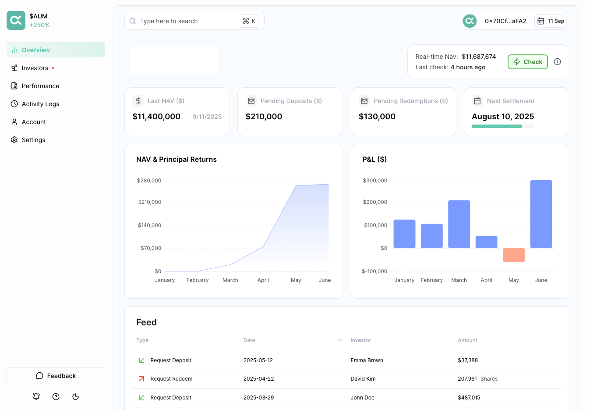

# Operating System

### Overview

AlephOS is the primary console for curator, leveraging an intuitive interface that translates complex operations into actionable tasks.

The web application is designed to streamline Vehicle configuration and deployment, allocator onboarding, initiate NAV settlement, and monitor operational and financial activity.

<figure><figcaption></figcaption></figure>

### Features

* **Settlement:** Initiate NAV settlement process to finalize deposits and redemptions with T+0 processing that dynamically mints and burns LP shares.
* **Dashboard:** Key metrics and financial performance, both restaker-level and vault-level.
* **Activity Logs:** Complete audit trail of all operations, transactions, and administrative actions.
