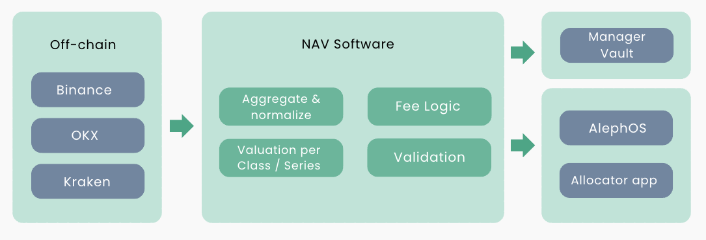

# NAV Engine

### Overview

The NAV Engine is a customized Oracle service responsible for calculating the Net Asset Value (NAV) of an individual manager. The system fetches raw data from trading venues, applies valuation and fee logic, and publishes results on-chain to settle deposits and redemptions.

<figure><figcaption></figcaption></figure>

The NAV Engine is designed to provide both managers and allocators with the highest standards of accuracy and auditability. Calculations are based on reconciled balances, market prices, and position valuations across multiple trading venues.&#x20;

**Indicative NAV (iNAV)**

On-demand NAV estimate for monitoring, dashboards, and indicative pricing. The iNAV utilizes data validation, reconciliation, and tolerance checks to identify and correct errors prior to final settlement.

**Settlement NAV**

The per-share NAV used to settle deposits, redemptions, and fees. Managers initiate the NAV settlement process through AlephOS for final approval, where Aleph Vaults handle capital distribution and mint/burn shares.   &#x20;

### Features

* **Aggregation:** collects raw data from off-chain trading venues and normalizes valuations into a consistent currency.
* **Calculation:** computes share value by class and series for accurate unit pricing.
* **Validation:** A predefined set of validation rules is applied to the calculated NAV to ensure accuracy and consistency.
* **Fee Logic:** management fees applied pro rata per time elapsed, performance fees applied above per-series high-water marks.
* **Settlement Triggering:** publishes Final NAV to vault contracts and initiates batch settlement of deposits and redemptions.
* **Transparency:** NAV publications, fee accrual, and settlement are logged on-chain for independent verification.&#x20;

