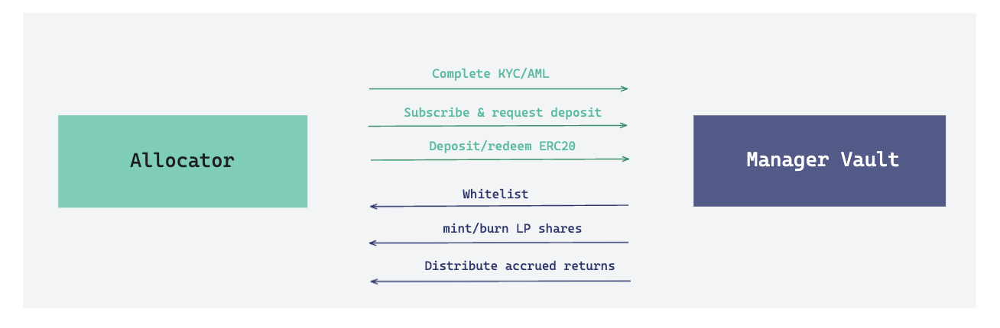
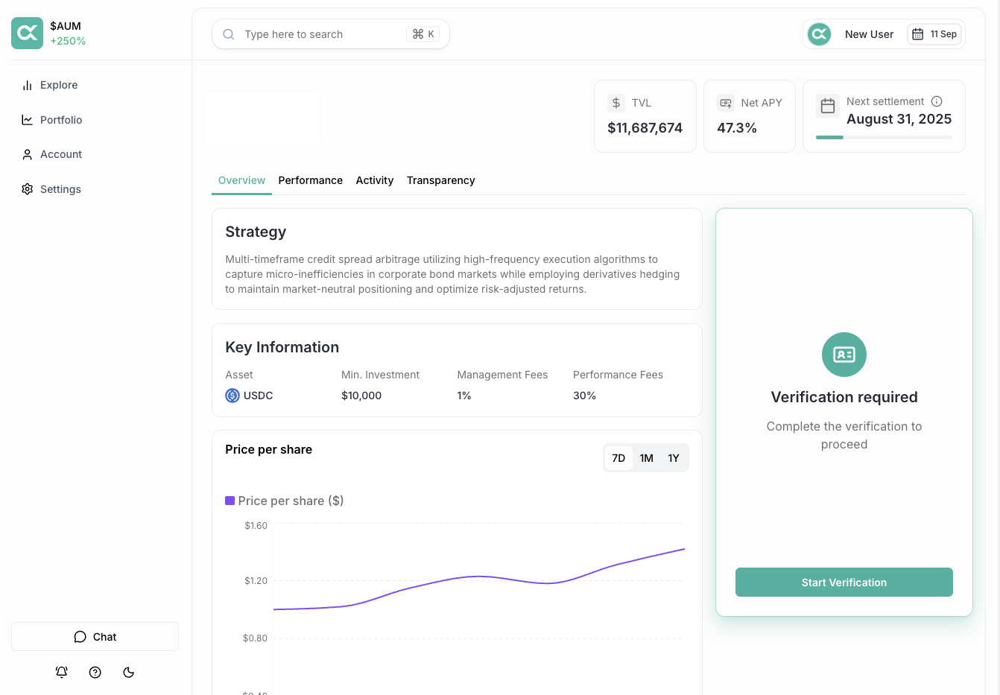

# Restakers

### Overview

Deposits restaked assets into Vault. For Allocator, Aleph enables access to institutional yield opportunities via EigenLayer&#x20;

<figure><figcaption></figcaption></figure>

### Key Details

* Allocators must be whitelisted and complete the required [verification](allocators.md#verification) before being eligible to access the manager vault.
* Eligible allocators can queue their deposit at any given time by executing a deposit request.
* Upon [settlement](../../learn/flows/settlement.md), the deposited assets are transferred to the manager, the vault mints new shares, and the allocators receive shares proportional to the vault AUM.
* A share unit represents the principal and accrued interest, and the underlying share value is derived from the yield-generating activities of the manager.
* Allocators can queue their redemption by executing a redeem request.
* Upon settlement, the redeemed assets are transferred to the allocator, and the vault burns the specified shares.
* Allocators can view the pending deposit and redeem request through the Allocator app.

### Allocator App

The Allocator web application is a digital storefront for seamless interactions. Through the app, allocators can explore manager performance, deposit assets, redeem their proportional value of the vault, and monitor their multi-strategy portfolio.

<figure><figcaption></figcaption></figure>

#### Features

* **Discovery** - Browse available vaults with detailed performance metrics.
* **Onboarding** - Internet-native and instant onboarding application.
* **Portfolio** - Monitor multi-manager portfolio with live financial metrics.
* **Transparency** - Auditable trail of NAV updates, settlements, and capital distribution.

