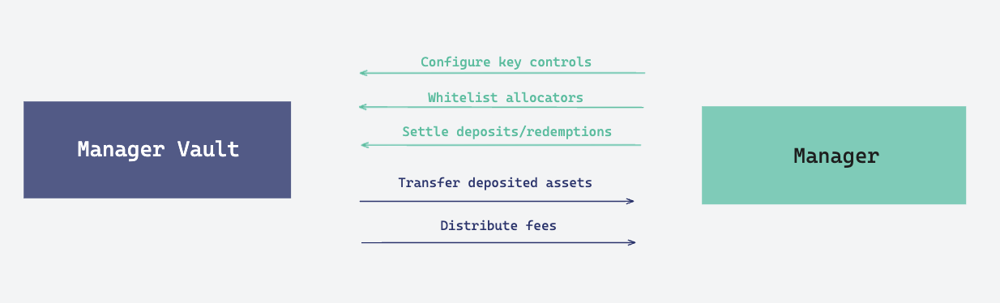

# Curators

### Overview

Offer LST strategies to Restakers, leveraging proprietary expertise to generate uncorrelated returns.

<figure><figcaption></figcaption></figure>

### Key Details

* Managers must be whitelisted before being eligible to use Aleph infrastructure.
* Manager self-deploys its own Vault through Aleph Factory and configures bespoke onboarding processes and subscription requirements.
* Manager reviews and approves allocators onboarding on an ongoing basis, authorizes them to access the vault contracts. Once eligible, allocators can submit a deposit request at any given time.
* Prior to settlement, the manager must review and sign the suggested NAV update retrieved from the NAV Engine, enabling the vault to automatically settle deposit and redemption requests.
* Upon settlement, the manager's wallet must maintain sufficient funds to cover accrued allocator fees and redemption requests.
